<div align="center" 
    style="background-color:#3B95D9; padding:15px; border-radius:8px; border:none;">
  <h1 style="color:black; margin:0; border:none; line-height:1;">
    Amazon Data Analysis & Review Score Prediction
    </h1>
</div>

## Project Overview 
This project analyzes Amazon U.S customer reviews to predict review scores (star_rating) using **PySpark** for large-scale data processing and machine learning. The dataset contains over **102 million product reviews** collected from the Amazon marketplace between **1995 and 2015**, along with associated metadata such as product category, helpfulness votes, purchase verification status, and review text. 

To prepare the dataset, distributed computing techniques were required to efficiently process and analyze appropriately. We are aiming to predict review ratings from textual and metadata features, allowing insights on practical applications in areas such as automated sentment analysis and product quality monitoring. However, building such predictive models presents several challenges, including class imblance in ratings, high-dimensional text features, and the computational complexity of processing large-scale records. 

As we address these challenges, we will perform distributed data exploration, feature engineering, and machine learning pipeline construction. The workflow includes **Exploratory Data Analysis** to handle missing values and transform features, and feature engineering to create meaningful predictors.

We hope to display how large-scale customer review datasets can be transformed into structured features suitable for predictive modeling. 

**Key Objectives:**
* Understand the **distribution** of reviews across products and product categories 
* Identify **patterns** in customer engagement metrics 
* Handle **missing** data and address class **imbalances** 
* Engineer **informative** features from review text and metadata
* Prepare scalable feature **pipelines** for machine learning modeling 

## Table of Contents
- [Github](#github)
- [SDSC Expanse Setup](#sdsc)
- [Data Exploration](#data)
- [Plots](#plots)
- [Preprocessing](#p2)
- [Complete Preprocessing](#p3)
- [Machine Learning](#ml)
- [Fitting Analysis](#fitting-analysis)
- [Conclusion](#conclusion)

## Milestone 2
<a id="github"></a>


**GitHub Organization / ID:**  
BGUO2025

**Project Repository:**  
[DSC-232R Final Project Repository](https://github.com/BGUO2025/DSC-232R-Final-Project)

**Dataset Source:**  
[Amazon Customer Reviews Dataset (Kaggle)](https://www.kaggle.com/datasets/cynthiarempel/amazon-us-customer-reviews-dataset)

```
base_dir = kagglehub.dataset_download('cynthiarempel/amazon-us-customer-reviews-dataset')

pattern = f'file:{base_dir}/amazon_reviews_us_*_v*.tsv'

reviews_df = (
    spark.read
        .option('header', 'true')
        .option('sep', '\t')
        .schema(schema)
        .csv(pattern)
        .withColumn('source_file', F.input_file_name())
        .withColumn('category', F.regexp_extract('source_file', r'amazon_reviews_us_([^/]+?)_v', 1))
        .filter(F.col('category') != 'multilingual')
        .drop('source_file')
)
```

We then loaded our data with the following schema: 
| Column                | Description |
|---                    | ------------------------------------------------------------------------------------|
| **marketplace**       | Country/region the review was posted on (e.g. US, UK)                               |
| **product_id**        | Unique identifier for the product (ASIN on Amazon) |
| **product_parent**    | Groups product variants (e.g. same book in hardcover/paperback) under one parent ID |
| **product_title**     | Name/title of the product                                                           |
| **product_category**  | Category the product belongs to (e.g. Wireless, Sports, Beauty)                     |
| **customer_id**       | Unique identifier for the reviewer                                                  |
| **review_id**         | Unique identifier for the review itself                                             |
| **star_rating**       | Rating given by the customer (1–5 stars)                                            |
| **review_headline**   | Short title/summary of the review                                                   |
| **review_body**       | Full text of the review                                                             |
| **review_date**       | Date the review was posted                                                          |
| **helpful_votes**     | Number of people who found the review helpful                                       |
| **total_votes**       | Total number of people who voted on the review (helpful or not)                     |
| **vine**              | Whether the reviewer is part of Amazon's Vine program (`Y`/`N`)                     |
| **verified_purchase** | Whether the reviewer actually bought the product on Amazon (`Y`/`N`)                |
| **category**          | Broader/redundant category label, possibly added during data processing             |

**Observations**: 
| Categorical       | Continuous   | Ordinal     | Text            | Temporal    |
|-------------------|--------------|------------ |-----------------|-------------|
| marketplace       | helpful_votes| star-rating | product_title   | review_date | 
| customer_id       | total_votes  |             | review_headline |             |
| review_id         |              |             | review_body     |             |
| product_id        |              |             |                 |             |
| product_parent    |              |             |                 |             | 
| product_category  |              |             |                 |             |
| vine              |              |             |                 |             |
| verified_purchase |              |             |                 |             |                  

* We have chosen to not cache the entire dataframe (40GB) due to limited temporary storage causing the process to fail. 
* When the cached SparkSQL Dataframe performed operations that required additional memory, Spark evicted cached data, spilling it to disk. The temporary storage quickly became full, causing constant crashes on the Jupyter kernel.
* Using SLURM commands, we hope to allocate more than one node to address memory limitations. Regardless, caching the entire dataframe may not be an appropriate or computationally effective approach.

<a id="sdsc"></a>


This project uses **PySpark** for distributed computing and **Matplotlib/Seaborn** for visualizations. 

To initialize our spark, we decided to utilize a 4GB exection size as our driving factor from this set based on previous experience working with social media analysis. This provides us with adequate memory headroom for groupBy and aggregation operations without creating excessively large JVM heaps that can otherwise increase garbage collection overhead. 

```
import pyspark
from pyspark.sql import SparkSession
from pyspark import StorageLevel
import matplotlib.pyplot as plt
import seaborn as sns

# Initializing our spark
"""
Formula == 
Executor instances = Total Cores - 1
Executor memory = (Total Memory - Driver Memory) / Executor Instances

Milestone 2
Executor instances = 32 − 1 = 31
Executor memory = (128 − 2) / 31 ≈ 4.06GB → 4GB per executor

Executor instances = 32 − 1 = 31
Executor memory = (128 − 2) / 31 ≈ 4.06GB → 4GB per executor

spark = (
    SparkSession.builder
    .appName('amazon_set')
    .config('spark.driver.memory', '4g')
    .config('spark.executor.instances', '7')
    .config('spark.executor.memory', '16g')
    .config('spark.executor.cores', '1')
    .getOrCreate()
)

Milestones 3 Update:
This set-up depends on the resources at hand. We had to update our Spark set-up due to memory leak and large overhead issues. We've run: 8 cores X 8GB, 8 cores X 16GB, 8 cores X 24GB. 

spark = (
    SparkSession.builder
    .appName('amazon_set')
    .config('spark.driver.memory', '4g')
    .config('spark.executor.instances', '7')
    .config('spark.executor.memory', '24g')
    .config('spark.executor.cores', '1')
    .getOrCreate()
)

```

Given the dataset's size of 54GB, this configuration provides: 
* High parallelism (31 concurrent tasks)
* Sufficient executor memory to reduce shuffle spill
* Balanced memory distribution to prevent executor OOM during aggregations

All executor data fetched from API and readable DataFrames will be formatted under Spark instead of pandas. 

```
import requests
import pandas as pd 

sc = spark.sparkContext
url = f"{sc.uiWebUrl}/api/v1/applications/{sc.applicationId}/executors"

response = requests.get(url)
executors = response.json()

df = pd.DataFrame(executors)[['id', 'totalCores', 'maxMemory', 'activeTasks', 'isActive']]
df['maxMemory_GB'] = (df['maxMemory'] / (1024**3)).round(2)
```
<div>
<style scoped>
    .dataframe tbody tr th:only-of-type {
        vertical-align: middle;
    }

    .dataframe tbody tr th {
        vertical-align: top;
    }

    .dataframe thead th {
        text-align: right;
    }
</style>
<table border="1" class="dataframe">
  <thead>
    <tr style="text-align: right;">
      <th></th>
      <th>id</th>
      <th>totalCores</th>
      <th>maxMemory</th>
      <th>activeTasks</th>
      <th>isActive</th>
      <th>maxMemory_GB</th>
    </tr>
  </thead>
  <tbody>
    <tr>
      <th>0</th>
      <td>driver</td>
      <td>8</td>
      <td>2388236697</td>
      <td>0</td>
      <td>True</td>
      <td>2.22</td>
    </tr>
  </tbody>
</table>
</div>

<a id="data"></a>


**Checked aspects** 
* Data size
```
row_memory_count(reviews_df)

Total row counts: 102899354 rows
Total estimated size: 117.77 GB
```

Processing a dataset of this scale exceeds memory limits of a typical single-machine environment such as pandas-based workflows. Using Spark will allow us to partition the dataset across multiple executors for parallel computation while managing memory usage through distributed storage and caching strategies. 

* Summary Statistic
```
reviews_df.describe().show()
```
| summary         | marketplace       | customer_id     | review_id      | product_id  | product_parent | product_title     | product_category  | star_rating     | helpful_votes  | total_votes | vine           | verified_purchase | review_headline   | review_body     | review_date    | category    |
|---------        |------------       |-----------------|----------------|-------------|----------------|-----------------------|----------------|---------------|---------------|-------------|-------|-----------------|-------------------------|-------------------------|---------------|---------|
| count     | 102,899,354 | 102,899,354  | 102,899,354 | 102,899,354   | 102,899,354    | 102,899,354 | 102,897,602  | 102,897,561 | 102,897,561 | 102,897,561  | 102,897,561 | 102,897,561   | 102,897,322    | 102,887,488 | 102,891,724  | 102,899,354 |
| mean      | None        | 28,337,279.36| None        | 1,425,824,476 | 500,333,796.44 | NaN         | None         | 4.16        | 1.90        | 2.54         | None        | None          | NaN            | Infinity    | None         | None        |
| stddev    | None        | 15,723,537   | None            | 1,936,226,418 | 288,790,891.53   | NaN                   | None           | 1.29          | 20.77         | 22.45       | None  | None            | NaN                     | NaN                     | None          | None    |
| min     | US         | 100,000          | R100007TERQ36I  | 0000000078    | 100,000,041      | Fine in Time           | 2002-08-07     | 1             | 0             | 0           | N     | N               | All was good :)          | I mad...                | 1995-06-24    | Apparel |
| max     | US         | 9,999,996        | RZZZZYOFYZ829   | BT00IU6O8K    | 999,999,945      | 🌴 Vacation On The Beach | "Red Spring Blossom Flowers with Yellow Bees..." | 5             | 47,524        | 48,362      | Y     | Y               | 🤹🏽‍♂️🎤Great product...  | 🛅🚑🚚🚏🚙🚈🚘🚈🚘🚏🚘🚙🚎🚎... | 2015-08-31    | Wireless |

The mean star_rating (target variable) of 4.16 suggests that the dataset is **heavily skewed** toward positive reviews. More specifically, a positive bias is commonly found in e-commerce platforms as satisfied customers are more likely to leave reviews. However, this imbalance may indicate that predicting the **majority** classes (4 and 5 stars) may **dominate** model behavior without proper feature engineering and data preprocessing. 

* Missing Values 

| Column            | Missing Count | Total Rows  | Missing % |
| ----------------- | ------------- | ----------- | --------- |
| product_category  | 1,752         | 102,899,354 | 0.0017%   |
| star_rating       | 1,793         | 102,899,354 | 0.0017%   |
| helpful_votes     | 1,793         | 102,899,354 | 0.0017%   |
| total_votes       | 1,793         | 102,899,354 | 0.0017%   |
| vine              | 1,793         | 102,899,354 | 0.0017%   |
| verified_purchase | 1,793         | 102,899,354 | 0.0017%   |
| review_headline   | 11,866        | 102,899,354 | 0.0115%   |
| review_date       | 7,630         | 102,899,354 | 0.0074%   |

Missing values are extremely rare, showing as below 0.02% across all features. Given the extremely large sample size, performing **listwise deletion** for the star_rating (target variable) and **simple deterministic imputation** for predictors is unlikely to affect the overall data distribution or model predictive performance. In other words, complex probabilistic imputation is not necessary and we opted for straightforward deletion and imputation to handle missingness.

<a id="plots"></a>


* Product categories distribution 
<p align="center">
  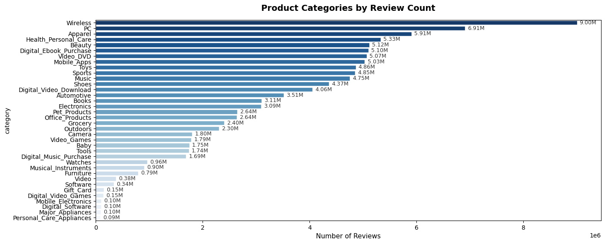
</p>

The distribution of product categories shows that there certain categories that signficantly contain more reviews than others. For example, **wireless** and **PC** products  dominate the dataset, which may reflect higher consumer demand and shorter replacement cycles. In contrast, categories such as **personal care appliances** appear less frequently as they may have less frequent repurchasing behavior and thus less reviews.

* Vine program participation 
<p align="center">
  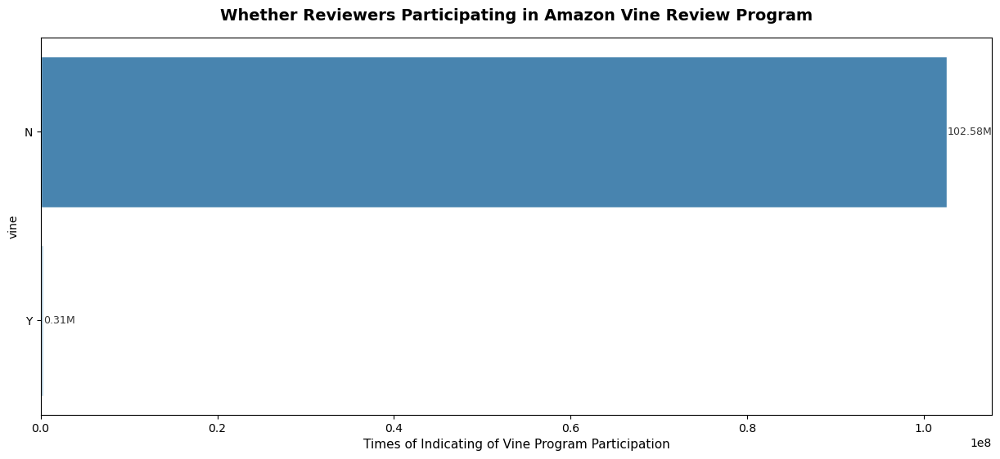
</p>

This plot indicates that only a small proportion of reviews come from Amazon's Vine program, where selected reviewers receive products in exchange for feedback. As such, its  small amount of data in comparison to regular reviews may introduce limited predictive value. 

* Verified purchase distribution 
<p align="center">
  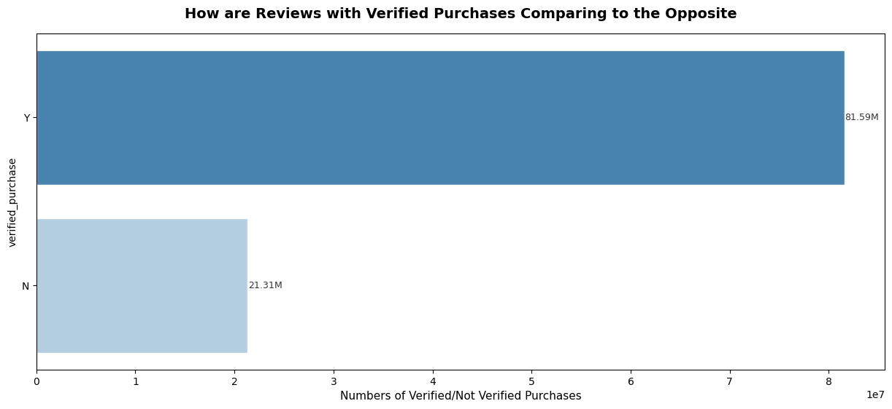
</p>

Verified purchases represent reviews from customers who purchased the product through Amazon. These are considered more trustworthy and may correlate with more reliable sentiment. This feature may help distinguish between genuine product experiences and less reliable feedback.

* Helpful votes histogram/boxplot 
<p align="center">
  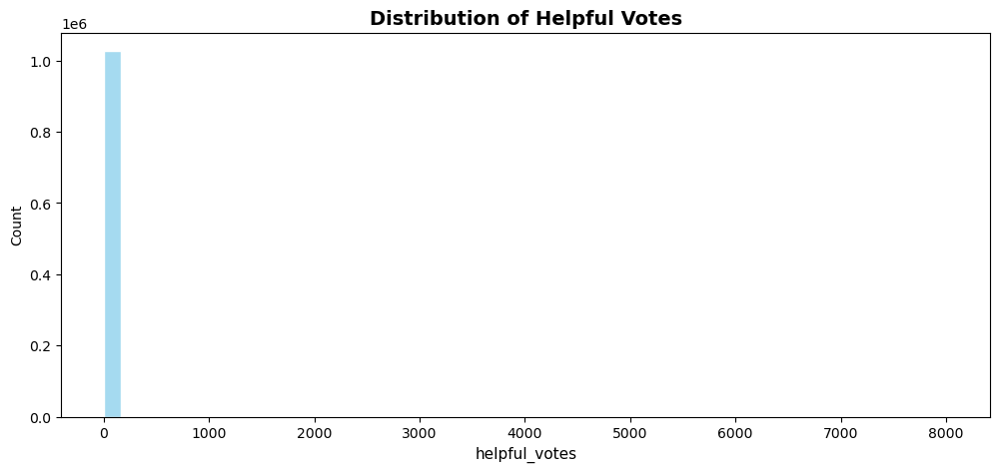
</p>
<p align="center">
  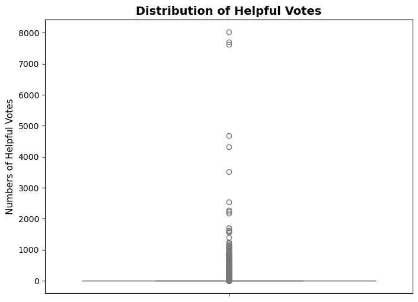
</p>

* Star rating distribution 
<p align="center">
  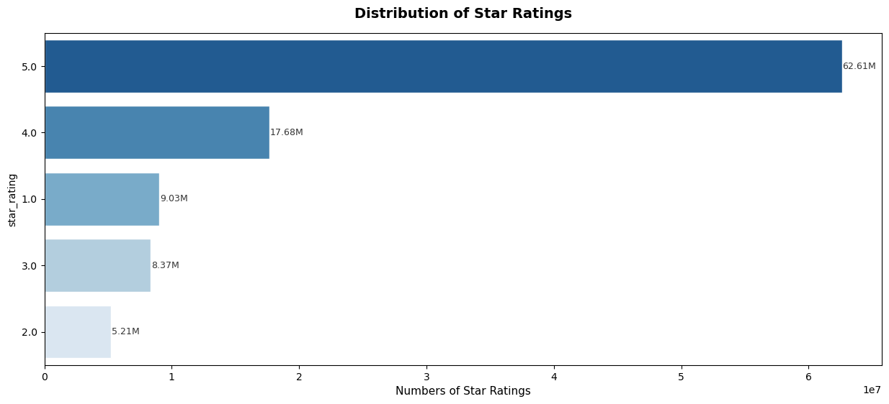
</p>

This distribution indicates a strong concentration of 5-star reviews (62.61 million), and may bias classification models towards predicting higher ratings. We will undergo class weighting during training to mitigate this bias. 

* Top products in sports category by number of reviews
<p align="center">
  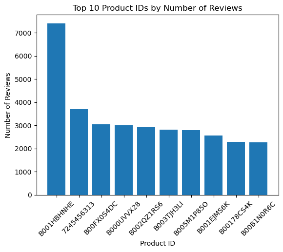
</p>

This provides a simple distribution of product IDs in relation to the previous product categories distribution chart. 

* Average rating vs. number of reviews (linear/log)
<p align="center">
  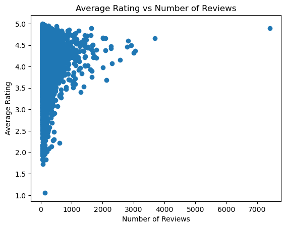
</p>

<p align="center">
  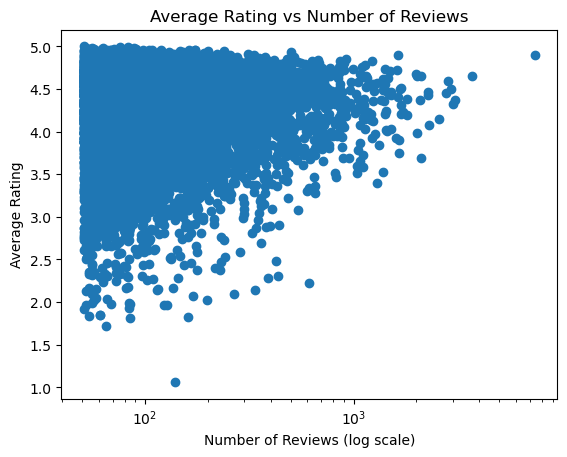
</p>

Here we examined both the linear and log relationships of average ratingand number of reviews. This relationship suggests that products with few reviews tend to exhibit higher variability inr atings. However, as the reviews increase in amount, the average rating appears to stabilities, indicating that larger review counts provide more reliable estimates of customer satisfaction. 


<a id="p2"></a>


The following sections describe the specific steps to prepare the data for modeling, including missing value handling, feature transformations, and balancing of target classes.

**Missing values**

We plan to remove observations that are missing critical information required for analysis. Reviws with missing review_body values will be excluded given that they would not provide meaningful signals for predicting review ratings. 

We will restrict the datset to reviews originating from the U.S marketplace since our feature engineering and modeling assumptions are based on English-language reviews. This will help to maintain consistency across the dataset.

**Data Imbalance** 

Potential data imbalance may arrise due to differences in sizes across product categories. To mitigate computational inefficiencies caused by large imbalancees, we will focus on using Spark to minimize unncessary shuffle operations that otherwise increase computation time in distributed environements. If imbalance in star_rating (target variable) becomes significant, we will consider techniques such as class weighting. 

**Transformations**

Several transformations will be applied to improvement dataset usefulness for machine learning. We will use the helpfulness ratio calculated by dividing helpful_votes by total_votes to gauage how useful reviews are perceived. A safeguard will be implemented such that when(total_votes > 0, helpful_votes / total_votes).otherwise(0) to ensure the feature remains usable. We will also convert product_category into numerical format with one-hot encoding. The review_body will be used to generate a new feature to represent the reviews' length. Lastly, these engineered features will be combined into a feature vector to predict the star_rating.

**Spark Operations**

Data preprocessing will use Apache Spark operations to clean and prepare the dataset. We will filter relevant records, use operations such as select(), filter(), and withColumn() to isolate necessary fields and create new features, and dropna() and fillna() to remove values with missing or duplicate values and assign default values, respectively. Additionally, using lower() and length(), we will convert review text to lowercase and compute each review's length.

## Milestone 3
<a id="p3"></a>


**Feature Selection**

* Kept: 
    - marketplace, product_id, product_title, 
    product_category, star_rating, helpful_votes, total_votes, verified_purchase, review_headline, review_body

* Dropped: 
    - customer_id, review_id, product_parent, vine, review_date

| Column            | Status  | Justification / Impact                                                                                              |
| ----------------- | ------  | ------------------------------------------------------------------------------------------------------------------- |
| marketplace       | ✅ | We limit the dataset to English reviews to ensure interpretability and consistent text encoding; this won’t add predictive value and can be dropped after filtering           |
| customer_id       | ❌ | Not necessary for prediction, but could theoretically allow aggregation of user behavior if we find users with high/low interest in relation to the number of reviews|
| review_id         | ❌      | No predictive value and can be removed
| product_id        | ✅ | Important for grouping reviews by product given there exists a multilingual dataset for reviews of the same product in various countries. Enables aggregation to help detect product-specific rating tendencies |
| product_parent    | ❌      | Not strictly necessary as aggregation can be done using product_id. It can aggregate reviews to improve computational efficiency when grouping similar product variations |
| product_title     | ✅      | Relatively helpful for sanity-checking product_id mappings and can be tokenized for NLP feature extraction if needed  |
| product_category  | ✅     | Useful for one-hot-encoding. Difference categories may have varying rating distributions. |
| star_rating       | ✅   | Target variable; ranking matters but intervals may not be perfectly aligned                                         |
| helpful_votes     | ✅ | Indicates perceived usefulness; can combine with total_votes to create helpfulness ratio, after that, we don't need it anymore                            |
| total_votes       | ✅       | Indicates overall engagement; can combine with helpful_votes to measure helpfulness ratio                           |
| vine              | ❌       | Binary; Amazon Vine reviews may indicate incentivized reviews, extreme class imbalance issues                                       |
| verified_purchase | ✅       | Affects credibility; verified reviews may correlate with stronger sentiment, obvious class imbalance      |
| review_headline   | ✅       | Useful for NLP processing as headlines often contain strong sentiment signals |                               
| review_body       | ✅       | Primary feature source to use for planned transformations such as tokenization, sentiment analysis, vocab frequency, and reviewing length feature |
| review_date       | ❌       | Despite enabling seasonality/trend analysis; can be transformed into month, year, or holiday-period indicators, we will need time-awared version of train/test split, which is not available in Spark MLlib            |

```
preprocess_df = (
    preprocess_df
    # Discard irrelevant features
    .select([
        feat 
        for feat in reviews_df.columns 
        if feat not in [
        'customer_id',
        'product_id',
        'product_title',
        'review_id',
        'product_parent',
        'product_category',
        'vine',
        'review_date'
        ]
    ])
    # Discard feature 'marketplace' after filtering
    .filter(F.col('marketplace') == 'US')
    .drop('marketplace')
    .withColumn("star_rating", F.col("star_rating").cast("double"))
)
```

**Import Modules** 
* Functions to preprocess, perform exploratory text analysis, and compute sentiment scores 
```
import time
start = time.time()

from functools import reduce
from pyspark.ml import Transformer, Pipeline
from pyspark.ml.param.shared import Param, Params
from pyspark.ml.feature import (
    StringIndexer, VectorAssembler, 
    StandardScaler, SQLTransformer
)
from pyspark.ml.classification import LogisticRegression, RandomForestClassifier
from pyspark.ml.evaluation import MulticlassClassificationEvaluator
import pandas as pd
import seaborn as sns
```

We are planning to explore HashDF with IDF, NO Word2Vec, semantic relationship, Sentiment Score, Text pReprocessing, text EDA, and other  [Kaggle Resources](https://www.kaggle.com/code/asadozzaman/text-data-preprocessing-sentiment-analysis#Step-1:Importing-Libraries).


**Sub-sample Dataframe for Testing (Row Sampling)**
```
preprocess_df = (
    reviews_df
    .sample(
        withReplacement=False, 
        fraction=0.01
    )
)
```

We used a subsample to make development and experimentation more efficient instead of processing the entire dataset. This will be removed when running the full production workflow as **preprocess_df** will be set equal to the entire **reviews_df** dataset to train and evaluate models using all available data. 

**Missing Value Handling (Row Filtering & Value Imputation)**

* Listwise deletion for star_rating (target variable)
```
preprocess_df = preprocess_df.filter(
    reduce(
        # Define action
        lambda x, y: 
        x & y,
        # Define a condition 
        [F.col('star_rating').isNotNull() | (F.col('star_rating') != "")]
     )
)
```

* Fill other features to 0, unknown, or empty strings
```
preprocess_df = preprocess_df.fillna({
    'category': 'Unknown',
    "verified_purchase": "Unknown",
    "review_headline": "",
    "review_body": "",
    'helpful_votes': 0,
    'total_votes': 0
})
```

* Check for missing values 
```
(
    preprocess_df
    # Project all columns
    .select([
        # Count all filtered values
        F.count(
            # When it meets these conditions
            F.when( F.col(c).isNull(), c)
        )
        # Rename to 'c'
        .alias(c)
        # Iterate all columns
        for c in preprocess_df.columns
    ])
    .show()
)
```
|star_rating|helpful_votes|total_votes|verified_purchase|review_headline|review_body|category|
|-----------|-------------|-----------|-----------------|---------------|-----------|--------|
|          0|            0|          0|                0|              0|          0|       0|


**Feature Engineering (New Features)** 

* Enhance predictive power by creating derived features

```
preprocess_df = (
    preprocess_df
    .withColumns({
        "helpful_ratio": F.when(
            F.col("total_votes") > 0,
            F.col("helpful_votes") / F.col("total_votes")
        ).otherwise(0),

        "review_len": F.length("review_body"),
        "review_word_counts": F.size(F.split(F.col("review_body"), " ")),

        "review_headline_len": F.length("review_headline"),
        "review_headline_word_counts": F.size(F.split(F.col("review_headline"), " "))
    })
    .drop('helpful_votes')
)

preprocess_df.select(['helpful_ratio','review_len', 'review_word_counts', 'review_headline_len', 'review_headline_word_counts']).show()
```

|     helpful_ratio|review_len|review_word_counts|review_headline_len|review_headline_word_counts|
|------------------|----------|------------------|-------------------|---------------------------|
|0.8571428571428571|       366|                71|                 17|                          2|
|               0.0|       169|                37|                 45|                         11|
|               0.0|       393|                76|                 56|                         13|
|               0.0|         4|                 1|                 10|                          2|
|               0.0|        85|                18|                 30|                          8|
(only showing top 5 rows)

To enrich the dataset, we derived several new features to provide the model with quantitative insights about review content. These features capture both the review quality indicators and text characteristics and are useful for predicting star ratings.

**Train/Test/Validation Sets**

* Split preprocessed dataset into training, validation, and test sets (70/15/15) to enable model training, hyperparameter tuning, and unbiased evaluation. 
```
# Caching
preprocess_df = preprocess_df.persist(StorageLevel.MEMORY_AND_DISK)

# Split to three datasets
train_df, val_df, test_df = preprocess_df.randomSplit(
    [0.7, 0.15, 0.15], 
    seed=42
)
# Caching
train_df = train_df.persist(StorageLevel.MEMORY_AND_DISK)

for df in [train_df, val_df, test_df]:
    row_memory_count(df)

Total row counts: 721544 rows
Total estimated size: 0.39 GB
Total row counts: 154655 rows
Total estimated size: 0.11 GB
Total row counts: 154573 rows
Total estimated size: 0.08 GB
```

To reduce recomputation and allow for efficient access during feature transformations, training, and evaluation, each split dataset was persisted in memory and disk using Spark's caching mechanism. The training set has 722k rows, while the validation and test sets each have approximately 155k rows.

**Feature Encoding**

* Categorical feature were encoded with StringIndexer to convert string labels into numeric indices. 

```
# Define categorical encoding (string indexer) step 
indexer1 = StringIndexer(
    inputCol='verified_purchase',
    outputCol='verified_purchase_idx',
    handleInvalid='keep'
)

indexer2 = StringIndexer(
    inputCol="category",
    outputCol="category_idx",
    handleInvalid="keep"
)
```

Features such as **verified_purchase** and **category** are categorical variables that cannot be used directly by most ML algorithmns in their original string format. 
We have applied **StringIndexer** such that each unique category is converted into a numerical index to process these features efficiently while also handling unseen values during training and evaluation through the **handleInvlaid = 'keep'** option. 

Several engineered features were introduced to capture review characterstics. 
* **helpful_ratio**: proportion of helpful_votes relative to total_votes; normalized measure of perceived review usefulness
* **review_len & review_headline_len**: length of the review body and headline
* **review_word_counts & review_headline_word_counts**: number of words in each text field 

These features aim to capture patterns where longer or more detailed reviews may convey stronger sentiment or informative feedback. Exploratory analysis of these variables exhibit a long-tailed, right-skewed distribution.

**Feature Engineering (Class Imbalance)**

* Compute relative class frequencies for star_rating and use class weights during model training

```
# Gather class count
weight_total_count = train_df.count()
weight_class_counts = (
    train_df
    .groupBy('star_rating')
    .count()
    .collect()
)
# Get weights as dictionary
weights_map = {
    class_row['star_rating'] : class_row['count']/ weight_total_count
    for class_row in weight_class_counts
}

# Define the transformer class to wrap around this operation
class ClassWeightAdder(Transformer):
    def __init__(self, inputCol="star_rating", outputCol="class_weight", weights_map=None):
        super().__init__()
        self.inputCol = inputCol
        self.outputCol = outputCol
        self.weights_map = weights_map or {}

    def _transform(self, df):
        # create Spark Map literal
        weights_spark = [
            F.lit(x) 
            for kv in self.weights_map.items() 
            for x in kv
        ]
        
        return df.withColumn(
            self.outputCol,
            F.create_map(weights_spark)[F.col(self.inputCol)]
        )

# Define the class re-weighting step
class_weights_transformer = ClassWeightAdder(
    inputCol="star_rating",
    outputCol="class_weight",
    weights_map=weights_map
)
```

As previously mentioned, the distribution of **star_rating** is highly imbalanced, with a large concentration of positive 4 to 5-star reviews for most products. To mitigate this imbalance, the added **class_weight** column will allow underrepresented class to contribute more strongly to the learning process and improve the model's ability to generalize across all rating categories. 


**Feature Scaling**

* Scaled numeric features to normalize distributions. 

```
# Define numeric features to be scaled
feature_cols1 = [
    "total_votes",
    "helpful_ratio",
    "review_len",
    "review_word_counts",
    "review_headline_len",
    "review_headline_word_counts"
]

## Define the assembler step
# Assemble them into arrays in form: 
# [helpful_ratio, total_votes, ..., 'review_headline_word_counts']
assembler1 = VectorAssembler(
    inputCols=feature_cols1,
    outputCol="assembled_features"
)

# Define the standard scaling step
# Scale numeric features that are skewed
scaler = StandardScaler(
    inputCol="assembled_features",
    outputCol="scaled_features",
    withMean=True,
    withStd=True
)
```

Numeric features such as **total_votes, helpful_ratio**, and other text-based length metrics can bias ML models if left unscaled due to skewed distributions. **VectorAssembler** and **StandardScaler** allows us to combine these features into a single vector and normalize to zero mean and unit variance. All features will contribute proportionally to ensure solid performance of algorithms sensitive to feature scale. 

**Feature Selection**

* Assembled final feature vector and chose relevant columns for model training.
```
# Define numeric features to be scaled
feature_cols2 = [
    "verified_purchase_idx",
    "category_idx",
    "scaled_features"
]

## Define the assembler step
# Assemble them into arrays in form: 
# [helpful_ratio, total_votes, ..., 'review_headline_word_counts']
assembler2 = VectorAssembler(
    inputCols=feature_cols2,
    outputCol="finalized_features"
)

# Define the drop step
col_remover = SQLTransformer(
    statement="""
    SELECT star_rating, finalized_features, class_weight
    FROM __THIS__
    """
)
```

Using **VectorAssembler** and **SQLTransformer**, we merged features and reduce memory overhead to ensure that the dataset only contains all necessary inputs while excluding extraneous columns that are not used in training. 

**Pipeline**

* Built a unified Spark ML to automate feature processing and dataset preparation.

```
# Define a pipeline using all previous steps
pipeline = (
    Pipeline(stages=[
        indexer1, 
        indexer2,
        class_weights_transformer,
        assembler1,
        scaler,
        assembler2,
        col_remover
    ])
    .fit(train_df)
)

# Fit and transform the pipeline
# Caching
train_final = pipeline.transform(train_df).persist(StorageLevel.MEMORY_AND_DISK)
val_final = pipeline.transform(val_df).persist(StorageLevel.MEMORY_AND_DISK)
test_final = pipeline.transform(test_df)

# Un-caching
preprocess_df.unpersist()
train_df.unpersist()

train_final.show(3)
val_final.show(3)
test_final.show(3)
```

Train:
|star_rating|  finalized_features|      class_weight|
|-----------|--------------------|------------------|
|        1.0|[1.0,2.0,-0.14636...|0.0880671368429527|
|        1.0|[1.0,2.0,-0.14636...|0.0880671368429527|
|        1.0|[1.0,2.0,-0.14636...|0.0880671368429527|

Validation:
|star_rating|  finalized_features|      class_weight|
|-----------|--------------------|------------------|
|        1.0|[1.0,2.0,-0.14636...|0.0880671368429527|
|        1.0|[1.0,2.0,-0.14636...|0.0880671368429527|
|        1.0|[1.0,2.0,-0.14636...|0.0880671368429527|


Test:
|star_rating|  finalized_features|      class_weight|
|-----------|--------------------|------------------|
|        1.0|[1.0,2.0,-0.14636...|0.0880671368429527|
|        1.0|[1.0,2.0,-0.14636...|0.0880671368429527|
|        1.0|[0.0,2.0,-0.14636...|0.0880671368429527|

This pipeline integrates all previous preprocessing and feature engineering stpes into a single workflow for consistent and reproducible data transformation. Sequentially, categorical encoding (**StringIndexer**)
, class weight assignment, humerical feature assembly, feature scaling, and final feature vector construction were pipelined. The same transformations are consistently applied across the training, validation, and test sets, without data leakage. Transformed training and validation sets are also cached, while intermediate datasets are unpersisted to free cluster memory.

**Pre-processing Time** 
```
elapsed = time.time() - start
print(f"Preprocessing took: {elapsed:.2f} seconds")

Preprocessing took: 222.31 seconds
```

<a id="ml"></a>


```
start = time.time()
```

**Baseline Model: Logistic Regression** 
```
evaluator = MulticlassClassificationEvaluator(
    labelCol='star_rating',
    predictionCol='prediction_lr',
    metricName='accuracy'
)

# Define model with weightCol
log_reg = LogisticRegression(
    featuresCol='finalized_features',
    labelCol='star_rating',
    predictionCol='prediction_lr',
    weightCol='class_weight',
    maxIter=20,
    regParam=0.0,
    elasticNetParam=0.0
)

# Fit and Transform
log_reg_model = log_reg.fit(train_final)
train_lr_pred = log_reg_model.transform(train_final)
val_lr_pred = log_reg_model.transform(val_final)

# Evaluate
print(f'LogReg Train Accuracy: {evaluator.evaluate(train_lr_pred):.4f}')
print(f'LogReg Validation Accuracy: {evaluator.evaluate(val_lr_pred):.4f}')

LogReg Train Accuracy: 0.6084
LogReg Validation Accuracy: 0.6069
```

Logistic Regression was used to establish an initial performance benchmark for predicting review **star_rating**. After incoporating several parameters such as **finalized_features** and **class_weight**, and fitting the model on the training dataset, predictions were generated for both the training and validation sets. Using **MulticlassClassificationEvaluator**, we gauged model perforamnced with a training accuracy of 60.84% and validation accuracy of 60.69%. 

**Improved Model: Random Forest**

* Set A
```
# Evaluate using Accuracy
evaluator = MulticlassClassificationEvaluator(
    labelCol='star_rating',
    predictionCol='prediction_rf',
    metricName='accuracy'
)

# Define model with weightCol
rf = RandomForestClassifier(
    featuresCol='finalized_features',
    labelCol='star_rating',
    predictionCol='prediction_rf',
    numTrees=25,
    maxDepth=8,
    maxBins=37,
    # seed=42,
    weightCol='class_weight'
)

# Fit and Transform
rf_model = rf.fit(train_final)
train_rf_pred = rf_model.transform(train_final)
val_rf_pred = rf_model.transform(val_final)

# Evaluate
print(f'SET A:')
print(f'RanFor Train Accuracy: {evaluator.evaluate(train_rf_pred):.4f}')
print(f'RanFor Validation Accuracy: {evaluator.evaluate(val_rf_pred):.4f}')

SET A:
RanFor Train Accuracy: 0.6098
RanFor Validation Accuracy: 0.6083
```

```
elapsed = time.time() - start
print(f"ML took: {elapsed:.2f} seconds")

ML took: 67.06 seconds
```

To improve our baseline Random Forest model, a **Random Forest classifier** was implemented to capture more complex, non-linear relationships. It was configured with **25 trees**, a **max depth of 8**, and **37 bins** to 
handle feature discretization during splitting. It achieved a training accuracy of 60.98% and a vlidation accuracy of 60.83% in a timespan of approximately 67 seconds.

* Set B

```
start = time.time()
```

```
# Define model with weightCol
rf_b = RandomForestClassifier(
    featuresCol='finalized_features',
    labelCol='star_rating',
    predictionCol='prediction_rf',
    numTrees=20,
    maxDepth=6,
    maxBins=37,
    # seed=42,
    weightCol='class_weight'
)

# Fit and Transform
rf_model_b = rf_b.fit(train_final)
train_rf_pred_b = rf_model_b.transform(train_final)
val_rf_pred_b = rf_model_b.transform(val_final)

# Evaluate
print(f'SET B:')
print(f'Ran For Train Accuracy: {evaluator.evaluate(train_rf_pred_b):.4f}')
print(f'Ran For Validation Accuracy: {evaluator.evaluate(val_rf_pred_b):.4f}')

SET B:
Ran For Train Accuracy: 0.6085
Ran For Validation Accuracy: 0.6070
```

* Set C
```
# Define model with weightCol
rf_c = RandomForestClassifier(
    featuresCol='finalized_features',
    labelCol='star_rating',
    predictionCol='prediction_rf',
    numTrees=25,
    maxDepth=10,
    maxBins=37,
    # seed=42,
    weightCol='class_weight'
)

# Fit and Transform
rf_model_c = rf_c.fit(train_final)
train_rf_pred_c = rf_model_c.transform(train_final)
val_rf_pred_c = rf_model_c.transform(val_final)

# Evaluate
print(f'SET C:')
print(f'Ran For Train Accuracy: {evaluator.evaluate(train_rf_pred_c):.4f}')
print(f'Ran For Validation Accuracy: {evaluator.evaluate(val_rf_pred_c):.4f}')

SET C:
Ran For Train Accuracy: 0.6119
Ran For Validation Accuracy: 0.6103
```

```
elapsed = time.time() - start
print(f"ML Hyperparameter Tuning took: {elapsed:.2f} seconds")
ML Hyperparameter Tuning took: 136.23 seconds
```

The hyperparameter tuning results indicate that increasing model complexity, particularly through greater tree depth, can provide small improvements in predictive performance, as seen in **Set C**, which achieved the highest training (61.19%) and validation (61.03%) accuracies. However, experimenting with larger configurations introduced practical **limitations** related to Spark resources. It signficantly raised memory usage, which occasionally resulted in **heap and memory** management issues during experimentation.

These resuts also suggest that the current feature set may be limiting model performance, indicating that additional feature engineering may be required to capture more predictive signals. Due to memory overhead when training on the full dataset, we consulted with course instructures and decided to continue experimentation on a **1% subsample of the dataset** and plan to scale to **5% or 10%** subsets as resources permit.

**Visualizations** 

```
start = time.time() 

# Evaluate using Accuracy
evaluator = MulticlassClassificationEvaluator(
    labelCol='star_rating',
    predictionCol='prediction_rf',
    metricName='accuracy'
)

# Initialize the error array
train_errs, test_errs = [], []

# Iterate it N times
start_num = 1
end_num = 50
for i in range(start_num, end_num, 2):
    # Define model with weightCol
    rf = RandomForestClassifier(
        featuresCol='finalized_features',
        labelCol='star_rating',
        predictionCol='prediction_rf',
        numTrees=i,
        maxDepth=8,
        maxBins=37,
        # seed=42,
        weightCol='class_weight'
    )
    
    # Fit and Transform
    rf_model = rf.fit(train_final)
    train_rf_pred = rf_model.transform(train_final)
    val_rf_pred = rf_model.transform(val_final)

    # Evaluate
    train_errs.append(evaluator.evaluate(train_rf_pred))
    test_errs.append(evaluator.evaluate(val_rf_pred))

df = pd.DataFrame(
    data={
        'Train_errors': train_errs,
        'Test_errors': test_errs
    }, 
    index=range(start_num, end_num, 2)
)

sns.lineplot(df, markers=True)

elapsed = time.time() - start
print(f"ML Fit Graph took: {elapsed:.2f} seconds")

ML Fit Graph took: 896.91 seconds
```

<p align="center">
  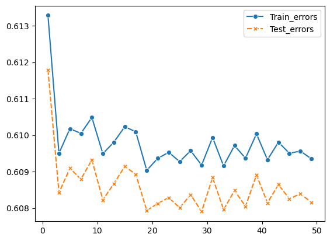
</p>

To further analyze the effective of model complexity on performance, we evaluated the Random Forest classifier across varying numbers of trees. As we increased the trees (x-axis) from **1 to 49** while other hyperparameters remained fixed, we stored and visualized the resulting line plot to compare performance trends between the two datasets. In other words, this may suggest that Random Forest is underfitting.

**Model Comparisons** 

```
from pyspark.ml.evaluation import RegressionEvaluator

rmse_eval_lr = RegressionEvaluator(
    labelCol='star_rating',
    predictionCol='prediction_lr',
    metricName='rmse'
)

rmse_eval_rf = RegressionEvaluator(
    labelCol='star_rating',
    predictionCol='prediction_rf',
    metricName='rmse'
)

# Logistic Regression
train_lr_rmse = rmse_eval_lr.evaluate(train_lr_pred)
val_lr_rmse = rmse_eval_lr.evaluate(val_lr_pred)

# Random Forest A
train_rf_a_rmse = rmse_eval_rf.evaluate(train_rf_pred)
val_rf_a_rmse = rmse_eval_rf.evaluate(val_rf_pred)

# Random Forest B
train_rf_b_rmse = rmse_eval_rf.evaluate(train_rf_pred_b)
val_rf_b_rmse = rmse_eval_rf.evaluate(val_rf_pred_b)

# Random Forest C
train_rf_c_rmse = rmse_eval_rf.evaluate(train_rf_pred_c)
val_rf_c_rmse = rmse_eval_rf.evaluate(val_rf_pred_c)

models = ['LogReg','RF_A','RF_B','RF_C']
```

* Train RMSE
```
train_rmse = [
    train_lr_rmse,
    train_rf_a_rmse,
    train_rf_b_rmse,
    train_rf_c_rmse
]

plt.figure(figsize=(8,5))
plt.bar(models, train_rmse)

plt.title('Training RMSE Comparison')
plt.xlabel('Model')
plt.ylabel('RMSE')

plt.show()
```

<p align="center">
  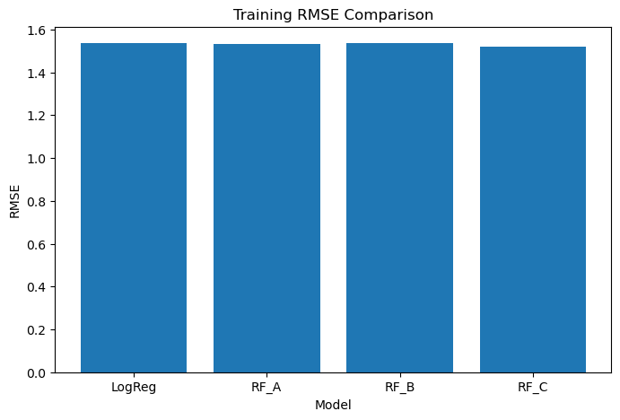
</p>

This comparison plot indicates that all four models, **Log Regression, Random Forest A, Random Forest B, and Random Forest C** produce similar RMSE values within the 1.52 to 1.54 mark. Minimal performance differences indicate that none of the models significantly outperforms the other on the training data. However, improving this performance for Random Forest may require **TF-IDF**,  **sentiment scores**, or additional engagement features to yield the greatest improvement in predictive performance. 

* Validation RMSE

```
val_rmse = [
    val_lr_rmse,
    val_rf_a_rmse,
    val_rf_b_rmse,
    val_rf_c_rmse
]

plt.figure(figsize=(8,5))
plt.bar(models, val_rmse)

plt.title('Validation RMSE Comparison')
plt.xlabel('Model')
plt.ylabel('RMSE')

plt.show()
```

<p align="center">
  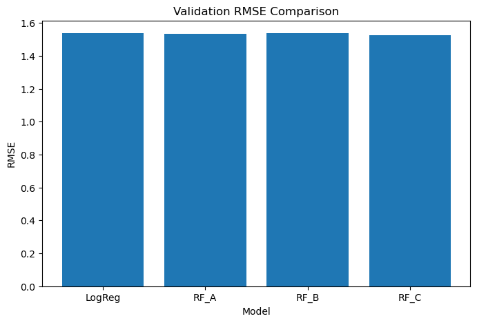
</p>

Similarly to the training data results, Random Forest did not signficantly outperform Log Regression, even with hyperparameter tuning. This suggests that improvements in model architecture alone may not substantially increase predictive performance with the current feature set.

* Actual vs. Predicted Scatter Plot

```
sample_df = val_rf_pred_b.select('star_rating', 'prediction_rf').sample(0.01).toPandas()

plt.figure(figsize=(6,6))
plt.scatter(sample_df['star_rating'], sample_df['prediction_rf'], alpha=0.3)

plt.plot([1,5],[1,5], linestyle='--')

plt.xlabel('Actual Rating')
plt.ylabel('Predicted Rating')
plt.title('Actual vs Predicted Ratings')

plt.show()
```

<p align="center">
  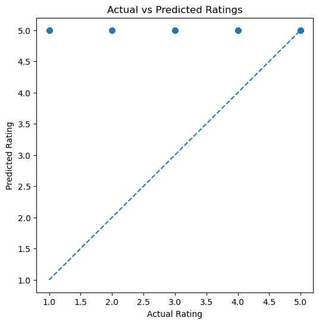
</p>

This plot compares the model's predicting ratings against true ratings; a diagonal line representing the ideal relationship where predicted ratings matches the actual rating. This pattern suggests that the model is strongly biased toward predicting the highest rating, which is consistent with the dataset’s class imbalance where 5-star reviews are the most common.

**Feature Importance (Random Forest)**

```
import matplotlib.pyplot as plt

feature_columns = [
    'verified_purchase_idx',
    'category_idx',
    'helpful_ratio',
    'total_votes',
    'review_len',
    'review_word_counts',
    'review_headline_len',
    'review_headline_word_counts'
]

importances = rf_model_b.featureImportances.toArray()

print('Feature count:', len(feature_columns))
print('RF importance count:', len(importances))

feature_importance = pd.DataFrame({
    'feature': feature_columns,
    'importance': importances
}).sort_values('importance', ascending=False)

print(feature_importance)

Feature count: 8
RF importance count: 8
                       feature  importance
5           review_word_counts    0.248081
4                   review_len    0.210397
2                helpful_ratio    0.169301
6          review_headline_len    0.126052
1                 category_idx    0.122743
3                  total_votes    0.105226
7  review_headline_word_counts    0.018200
0        verified_purchase_idx    0.000000
```


<p align="center">
  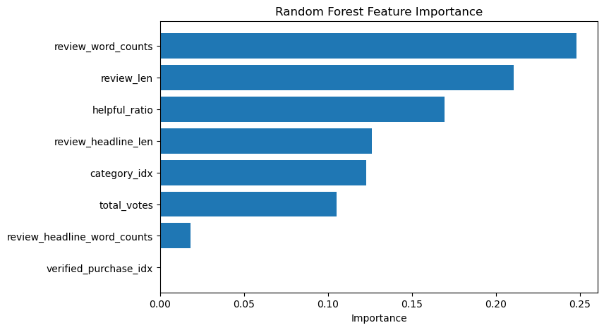
</p>

To better understand which features contribute most to predicting review ratings, we examined importance scores generated by the Random Forest model. The results show **text-based review characteristics** as the most influential predictors. In particularly, **review_word_counts** and **review_len** have the highest scores, suggesting that more detailed reviews provider stronger signals about the final star rating, supporting what we previously hypothesized. In contrast, **verified_purchase_idx** shows negligble importance, suggesting that whether a purchase was verified does not significantly influence rating prediction within this model.

<a id="fitting-analysis"></a>


**Model Fit in Fitting Graph**

We initially experimented with a **Logistic Regression** model as a preliminary test, achieving a 60.84% training accuracy and 60.69% validation accuracy, recognizing that this model is limited in capturing non-linear relationships and present feature interactions in the dataset.

Our primary focus was the **Random Forest** model, which achieved 60.98% training accuracy and 60.83% validation accuracy. The small difference between training and validation performance indicates that underfitting is minimal. However, the overall accuracy remains modest, suggesting the model may be overfitting. Enhancing feature representation or increasing model complexity can improve predictive performance. 


**Building with Different Hyperparameters to Compare**

To explore how model performance can be improved, we trained additional Random Forest models with modified hyperparameters such as increasing the number of trees, adjusting maximum depth, and varying feature sample strategies. These experiments help to identify the optimal configuration for reducing bias and variance while maintaining generalization on the validation set. 

**Best-Performing Model**

The Random Forest model with tuned hyperparameters that balance depth, trees, and feature sample appeared the best. There were slightly higher validation accuracy than the default configuration, though the default remains our base model due to its ability to capture complex interactions and its stable performance across different feature subsets.


**Next Models (Milestone 4)**

For the next stage of this project, we are considering **Gradient Boosted Trees (GBT)** as a natural progression from our initial Random Forest model. This choice is motivated by several factors: 

* **Ability to capture non-linear feature interactions:** GBTs can model complex relationships such as those between purchase status, product category, and review characteristics.

* **Comparison of ensemble methods:** Evaluating both Random Forests and GBTS can provide a controlled evaluation of varying strategies to help us understand the trade-offs between variance reduction and bias correction

* **Evaluation metrics:** Using RMSE on the validation and test sets allows us to quantify performance differences and determine if additional complexity of boosting corresponds to meaningful improvements.

On one hand, Random Forests reduce variance through parallel and independent tree averaging. It is robust, less sensitive to hyperparameters, and less prone to overfitting. On the other, Gradient Boosted Trees can reduce bias by sequentially corrected errors from previous trees. By training both models and evaluating them using RMSE on the validation and test sets, we can determine whether the additional complexity of boosting provides meaningful improvements over the more stable Random Forest baseline. In turn, it can achieve higher accuracy, though it is more computationally intensive and sensitive to hyperparameters, making careful tuning essential. 

<a id="conclusion"></a>


**First Model Conclusion**

The first model, **Log Regression**, serves as a preliminary baseline using the available features as it primarily focuses on textual features from review_body and review_headline, metadata from product_caegory and verified_purchase, and engagement metrics. Textual sentiment and review content within this model can provide meaningful signals for predicting ratings, though the performance is limited from the initial feature engineering's simplicity. In other words, this model captures general patterns, but may otherwise struggle with nuanced sentiment or contextual information that influences ratings.

**Possible Improvements on First Model**

To improve, we shifted our focus to a **Random Forest** model, which can capture more complex, non-linear relationships and feature interactions that Log Regression cannot. Further enhancements can include richer feature engineering, such as TF-IDF vectors, sentiment scores, or interaction features. Hyperparameter tuning of the Random Forest can also work to potentially improve predictive accuracy and generalization on the validation set.

**Distributed Computing** 

Distributed computing played a critical role in making this project feasible given the scale of the dataset. Given the size of this dataset containing over 100 million records (~54GB), it would be difficult to efficiently process on a single machine.By using Spark, the workload is distributed across multiple worker nodes, allowing data processing, feature engineering, and model training to occur in parallel.

Spark partitions the dataset across the cluster so that operations such as filtering, aggregations, and transformations can be executed simultaneously on different portions of the data. This significantly reduces computation time and allows the system to handle datasets that exceed the memory limits of a single machine. 

Additionally, Spark’s distributed ML libraries (such as MLlib) enable models like Random Forest and Gradient Boosted Trees to train using parallelized tree construction and data sampling.
For this project, distributed computing allowed us to efficiently perform large-scale preprocessing, feature engineering, and model training while managing memory constraints. Without distributed processing, loading and analyzing the full dataset would likely require significant hardware resources or extensive data reduction before modeling.

